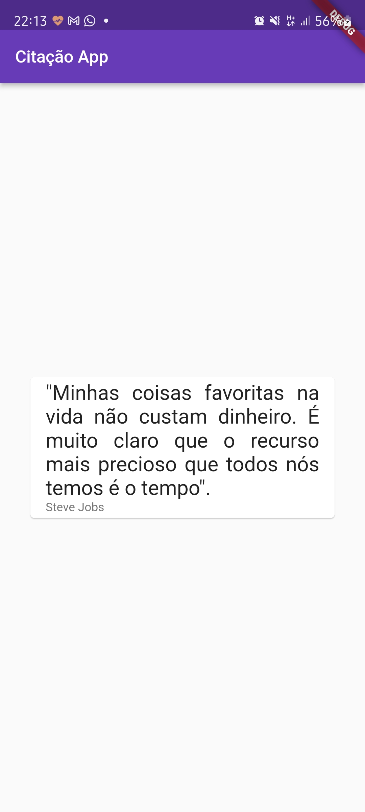
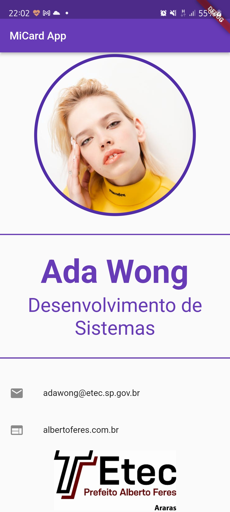

# Entrega Flutter 02

## Tutorial 

Primeiramente crie um novo projeto, neste tutorial iremos utilizar o nome `ds3_pam_2_atividade_entrega_02`.

Siga os passos abaixo para a conclusão dos 2 Apps solicitados na tarefa.

### CitacaoApp

O App de citação é muito simples e basicamente ele exibe um card com uma citação de um autor de sua preferencia.



#### Criando o Layout do Zero

1. Apague o arquivo `test/widget_test.dart`.
2. Abra o arquivo todo o conteúdo do arquivo `lib/main.dart`.
3. Inclua a importação do pacote Material para uso dos componentes do Google Material Design.

```dart
import 'package:flutter/material.dart';
``` 

4. Crie um Stateless Widget que representará o App de entrega

```dart
class EntregaDois extends StatelessWidget {
  const EntregaDois({ Key? key }) : super(key: key);

  @override
  Widget build(BuildContext context) {
    return MaterialApp(
      home: CitacaoPage(),
    );
  }
}
``` 
5. Crie o diretório `pages` dentro raiz do projeto, no mesmo nível do arquivo `main.dart`.
6. Dentro do diretório `pages`, crie o arquivo `citacao_page.dart`.
7. No arquivo `citacao_page.dart` crie o statless widget `CitacaoPage`.

```dart
import 'package:flutter/material.dart';

class CitacaodApp extends StatelessWidget {
  const CitacaodApp({Key? key}) : super(key: key);

  @override
  Widget build(BuildContext context) {
    return Scaffold(
      appBar: AppBar(
        title: const Text('Citação App'),
      ),
      body: const Center(
        child: Card(
          margin: EdgeInsets.all(32),
          child: ListTile(
            title: Text(
              '"Minhas coisas favoritas na vida não custam dinheiro. É muito claro que o recurso mais precioso que todos nós temos é o tempo".',
              style: TextStyle(fontSize: 24),
              textAlign: TextAlign.justify,
            ),
            subtitle: Text('Steve Jobs'),
          ),
        ),
      ),
    );
  }
``` 

8. No arquivo `main.dart`, importe o arquivo `pages/citacao.dart`.

```dart
import 'pages/citacao.dart';
``` 

9. Crie o layout do Card de Citação.

```dart
import 'pages/citacao.dart';
``` 

10. Adicione o método main ao `main.dart` e execute a aplicação.

```dart
main() => runApp(EntregaDois());
``` 
11. Altere o padrão de cores da aplicação conforme sua preferência, abaixo segue um exemplo, no `main.dart`.

```dart
main() => runApp(EntregaDois());

class EntregaDois extends StatelessWidget {
  const EntregaDois({Key? key}) : super(key: key);

  @override
  Widget build(BuildContext context) {
    return MaterialApp(
      theme: ThemeData(primarySwatch: Colors.deepOrange),
      home: CitacaoPage(),
    );
  }
}
``` 

## Concluímos o Primeiro App da Entrega 02.

### MiCard App

O MiCard App terá a mesma estrutura do Citação App, porém desta vez utilizaresmo uma coluna como Widget principal do Layout.



1. Dentro do diretório `pages`, crie o arquivo `micard_page.dart`.
2. No arquivo `micard_page.dart` crie o statless widget `MiCardPage`.

```dart
import 'package:flutter/material.dart';

class MiCardPage extends StatelessWidget {
  const MiCardPage({Key? key}) : super(key: key);

  @override
  Widget build(BuildContext context) {
    return Scaffold(
      appBar: AppBar(
        title: const Text('MiCard App'),
      ),
      body: Column(
        children: [
          
        ],
      ),
    );
  }
}
``` 

3. Troque os Widgets de inicialização no `main.dart`;

```dart
main() => runApp(EntregaDois());

class EntregaDois extends StatelessWidget {
  const EntregaDois({Key? key}) : super(key: key);

  @override
  Widget build(BuildContext context) {
    return MaterialApp(
      theme: ThemeData(primarySwatch: Colors.deepOrange),
      // Neste trecho iremos fazer a troca dos Widgets de inicialização
      home: MiCardPage(),
    );
  }
}
``` 

4. Agora vamos adicionar os Widgets à nossa Column, dentro da propriedade `children: []`, adicione o conteúdo abaixo.

```dart
/* 
    O CircleAvatar facilita a criação de um Avatar Circular, 
    basta definirnos o radius e um image provider,
    nós utilizaremos o ImageNetwork que faz o download de um recurso externo de imagem. 
  */
  CircleAvatar(
    radius: 135,
    child: CircleAvatar(
      radius: 130,
      backgroundImage: NetworkImage(imageUrl),
    ),
  ),
  // O Divider, bem sugestivo, é um Widget que cria uma divisão simples na Column.
  Divider(
    height: 50,
    thickness: 2,
    color: Theme.of(context).primaryColor,
  ),
  // Texto com estilização de cor, tamhao e peso.          
  Text(
    'Ada Wong',
    style: TextStyle(
      color: corPrimaria,
      fontSize: 60,
      fontWeight: FontWeight.bold,
    ),
  ),
  Text(
    'Desenvolvimento de Sistemas',
    style: TextStyle(
      color: corPrimaria,
      fontSize: 36,
    ),
    textAlign: TextAlign.center,
  ),
  Divider(
    height: 50,
    thickness: 2,
    color: Theme.of(context).primaryColor,
  ),
  const ListTile(
    leading: Icon(Icons.email),
    title: Text('adawong@etec.sp.gov.br'),
  ),
  // Desta vez utilizamos a propriedade leadind(esquerda) do ListTile para adicionar um icone
  const ListTile(
    leading: Icon(
      Icons.web,
    ),
    title: Text('albertoferes.com.br'),
  ),
  // Neste SizedBox fizemos o download do Logo do Alberto feres
  SizedBox(
    height: 100,
    child: Image.network(
      logoEtec,
      fit: BoxFit.fitHeight,
    ),
  ),

```  

5. Teste o aplicativo.
6. Altere o swatch de core no `main.dart`.

```dart
  @override
  Widget build(BuildContext context) {
    return MaterialApp(
      theme: ThemeData(primarySwatch: Colors.deepPurple),
      home: const MiCardPage(),
    );
  }
}
``` 

# Finalizamos

